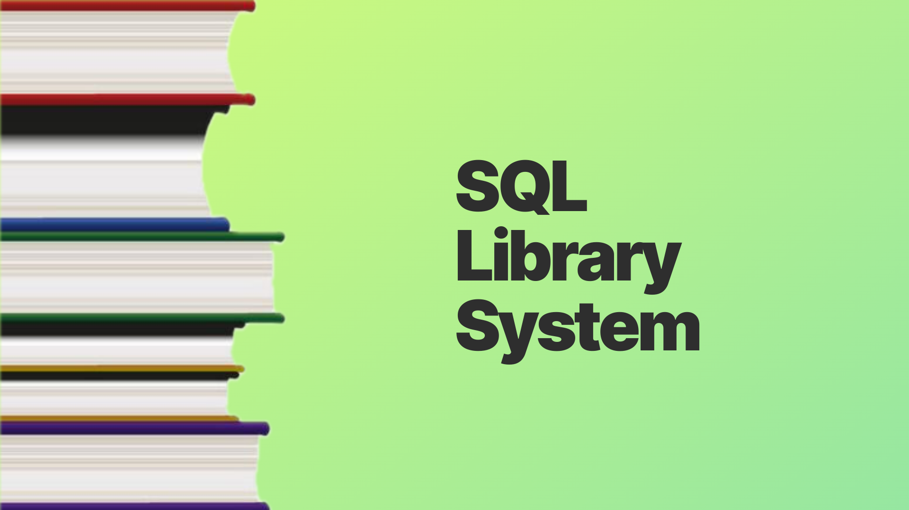

# SQL Library System

## About the Project
This repository contains a collection of SQL scripts designed for managing a Library System. Built using MySQL and MySQL Workbench, this project aims to provide efficient and effective tools for handling various library operations such as book management, user accounts, and transaction tracking.

## Features
* Database Schema: A comprehensive design of tables, relationships, and constraints suitable for a library system.
* CRUD Operations: Scripts for creating, reading, updating, and deleting records.
* User Management: Manage library members, staff accounts, and their permissions.
* Inventory Management: Track books, authors, publishers, and stock levels.
* Transaction Handling: Scripts for handling checkouts, returns, and fines.
* Data Integrity: Ensures the consistency and accuracy of data through constraints and triggers.
* Reports: Generate reports on inventory, user activity, and more.
